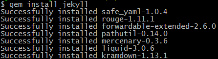

> ruby dk.rb init  

  

> ruby dk.rb install  

  

> gem sources -l

  

> gem install jekyll

  

> gem sources --remove https://rubygems.org/

  

> gem sources -a http://gems.ruby-china.org/

  

>gem install jekyll

  

