*** rubyinstaller-2.3.1.exe ***  
*** DevKit-mingw64-32-4.7.2-20130224-1151-sfx.exe ***

> ruby dk.rb init  

  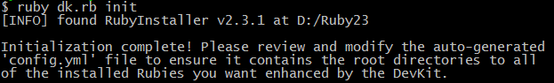

> ruby dk.rb install  

  

> 如果这里出现错误，查看D:\DevKit\config.yml  

  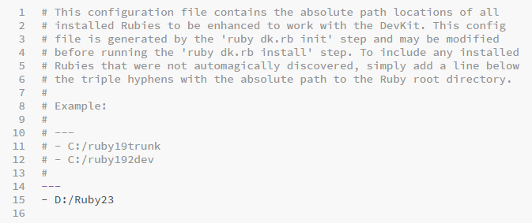

> gem sources -l

  

> gem install jekyll

  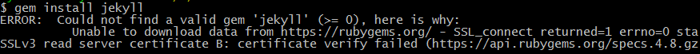

> gem sources --remove https://rubygems.org/

  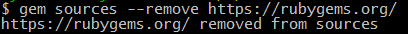

> gem sources -a http://gems.ruby-china.org/

  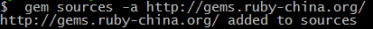

>gem install jekyll

  

>jekyll new testBlog

  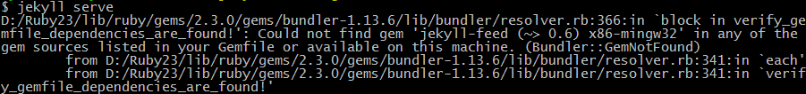

> gem install bundler

  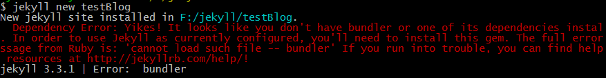

> jekyll serve

  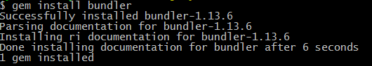

> jekyll serve

  

> gem install minima

  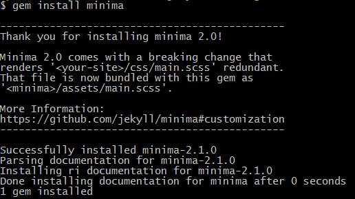

> jekyll serve

  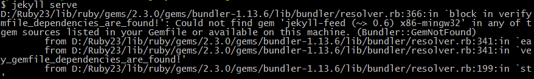

> gem install jekyll-feed

  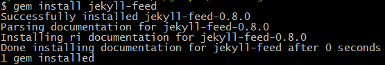

> jekyll serve

  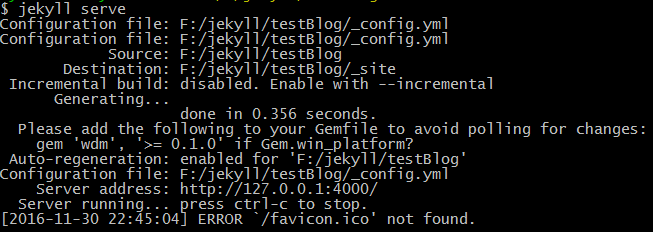

> http://127.0.0.1:4000/ 访问如下

  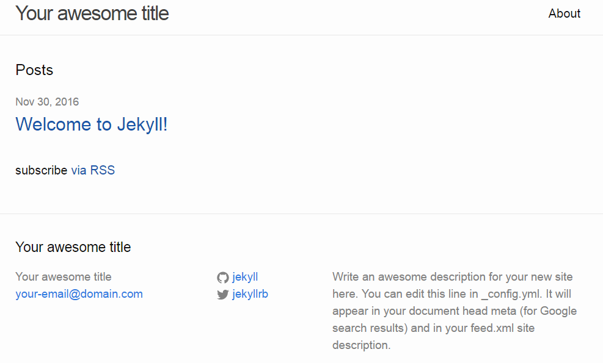

